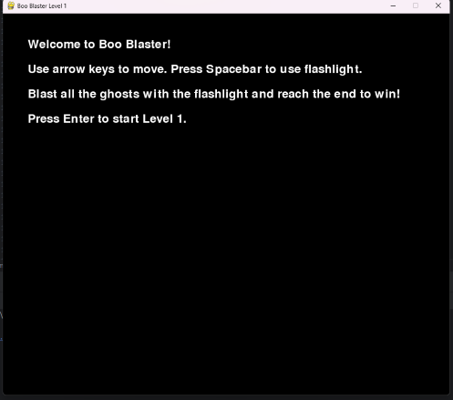

# Boo Blasters

This is a ghost hunting adventure game developed using Pygame. The game features two levels: a graveyard and a haunted attic. Players must explore these locations and blast ghosts using a flashlight.

## How to Play

1. Clone the repository
   
2. Install the required libraries

3. Run the game

4. Follow the on-screen instructions to play the game.

5. Game Features

Two levels with different environments.
Various types of ghosts to capture.
Challenging gameplay with increasing difficulty.

Enjoy the game and happy ghost hunting!